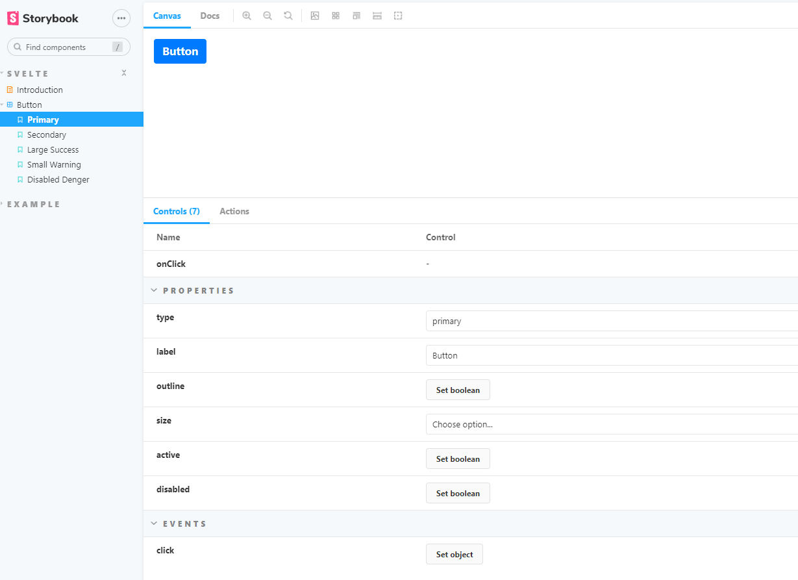

# 如何写组件？

    通过storybook基于svelte、bootstrap4学些如何写自己的组件


## 创建storybook目录

- src/stories-svelte
  - Introduction.stories.mdx
  - button.stories.svelte

## 创建组件目录

- src/components
  - index.ts
  - button
    - Button.svelte
    - index.ts

## 引入bootstrap

```
  npm i -D bootstrap@4.6.1
```

## 添加bootstrap样式

  修改配置svelte.config.js，从配置中引入bootstrap.scss。

  <span style="color:red;">通过vite配置引入无效</span>


  ```javascript
  	preprocess: [
      preprocess({
        postcss: true,
        scss: {
          prependData: `@import "bootstrap/scss/bootstrap.scss";`,
          outputStyle: 'compressed',
        },
        preserve: ['ld+json'],
      })
	] ,
  ```

## 修改storybook配置
  
  必须配置后才能使用bootstrap样式，修改.storybook/main.js文件

  1. 配置addons
   
  ```javascript
    npm i -D @storybook/preset-scss

    "addons":[
      "@storybook/preset-scss"
    ]

  ```
   
  2. 配置svelteOptions
   
  ```javascript
    "svelteOptions": {
      "preprocess": [
        sveltePreprocess({
          postcss: true,
          scss: {
            prependData: `@import "bootstrap/scss/bootstrap.scss";`,
            outputStyle: 'compressed',
          },
          preserve: ['ld+json'],
        }),
      ]
    }
  ```

## 创建组件

  在src/components目录中创建组件Button
  src/components
    - button
      - button.css
      - Button.svelte
      - index.ts
    // 组件全局入口
    - index.ts
    // 组件全局样式
    - index.scss
  
  打开bootstrap官网组件章节，[Button](https://v4.bootcss.com/docs/components/buttons/)，将对应的class提取为变量，同时添加按钮点击事件，基于createEventDispatcher将事件分发到组件上。

  主要使用了bootstrap的样式，bootstrap相关的js实现由组件实现。

```svelte
  
  <!-- <button type="button" class="btn btn-primary">Primary</button> -->
  <button 
    type="button" 
    class={['btn', `${_btnPrefix}-${type}`, `btn-${size}`].join(' ')}
    aria-pressed={active}
    {..._props}
    on:click={onClick}>
    {label}
</button>

<script lang="ts">
  // export ...

  const dispatch = createEventDispatcher();

  export const onClick = (event)=>{
    dispatch('click', event);
  }
</script>

```

## 编写Story

    在src/stories-svelte目录下创建Button.stories.svelte与.xmd文件

    编写Story主要使用了<Mate/> <Template> <Story> 三个标签。
    Mate: 定于组件相关的属性，方法等，注意title对应了页面的路径
    Template: 定义Story模板
    Story: 故事示例

```svelte

<Meta
  title="Svelte/Button"
  component={Button}
  argTypes={{
    label: { control: "text" },
    ...
    disabled: {control: 'boolean'},
    onClick: { action: "onClick" },
  }}
/>

<Template let:args>
  <Button {...args} on:click={args.onClick} />
</Template>

<Story
  name="Primary"
  args={{
    type : 'primary',
    label: "Button",
  }}
/>

```

## 启动测试


  npm run storybook

  --no-manager-cache

  

## 总结

  1. 整个过程和开发组件一样，引入了storybook主要是方便组件的测试与预览
  2. 项目的配置和storybook是独立的
  3. storybook是基于CommonJs的，如果项目基于ESM，注意配置或通过tjs、mjs处理
  4. *.storybook.svelte文件可以放在src任何地方，参考.storybook/main.js
  5. svelte.config.js使用了vite，目前对于这块配置不太清楚，但是处理scss文件时，vite的配置没有起作用